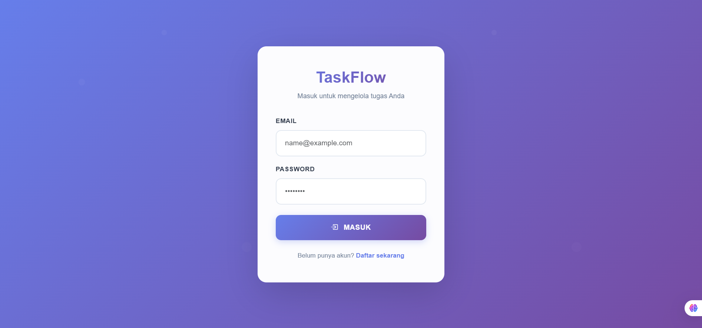
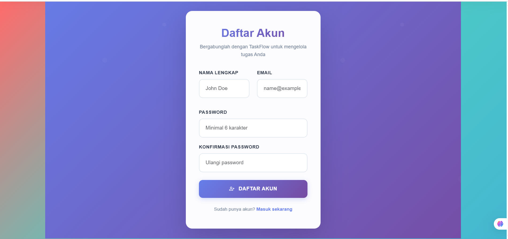
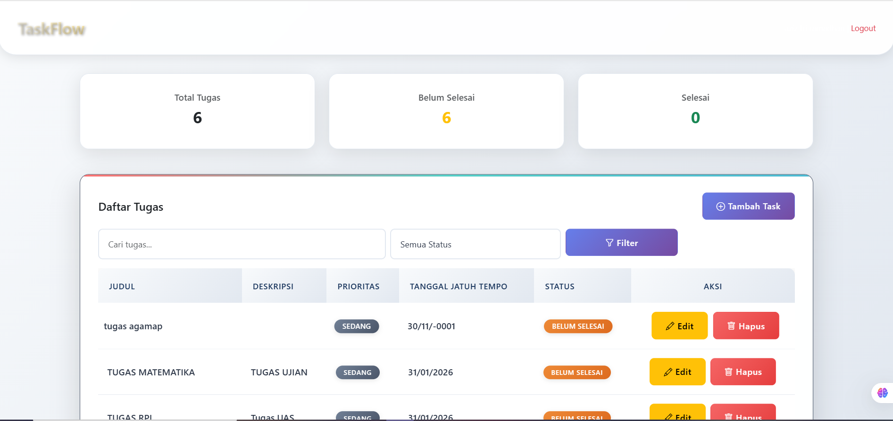
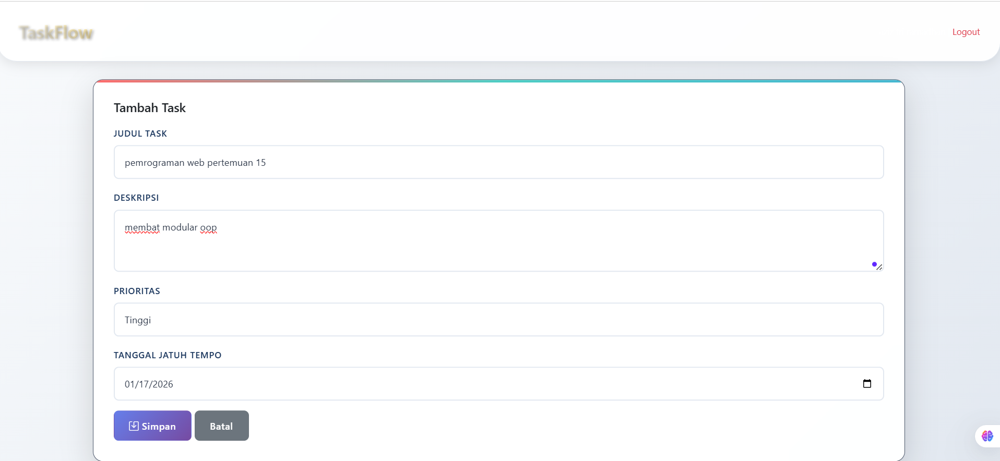
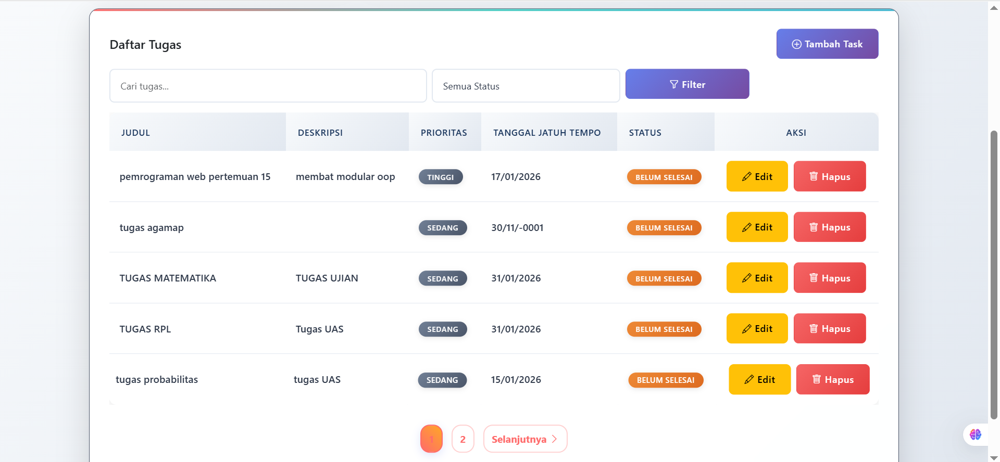
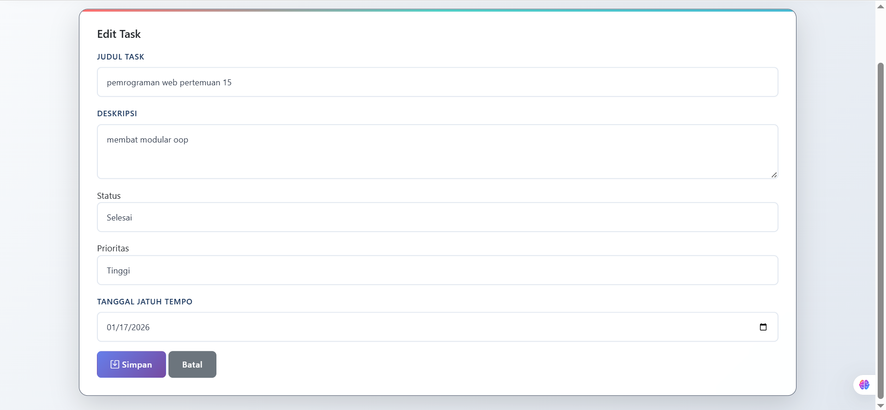
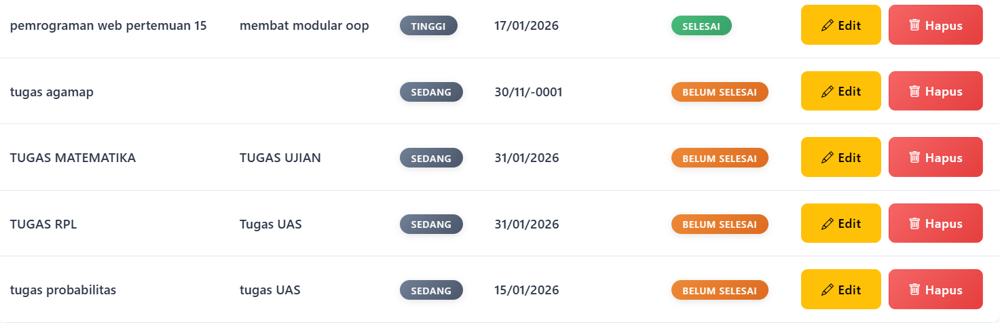
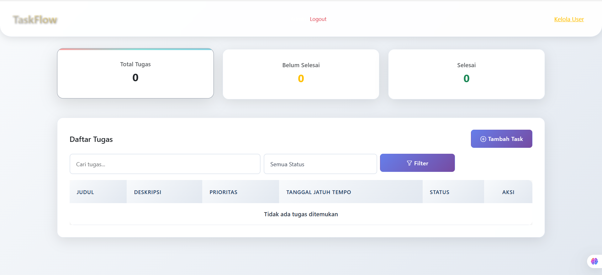
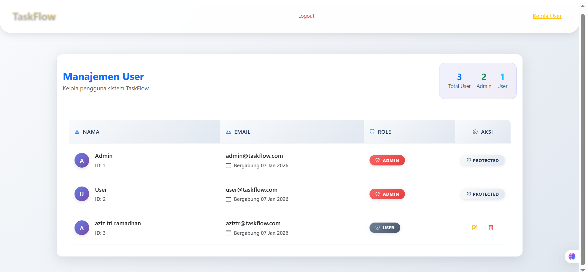
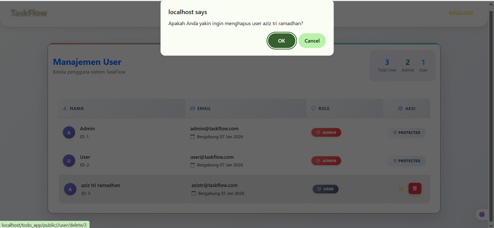

# TaskFlow - Aplikasi Manajemen Tugas Berbasis Web

## UNIVERSITAS PELITA BANGSA

## ULANGAN AKHIR SEMESTER
## PEMROGRAMAN WEB

**Nama**   : Muhammad Aziz Tri Ramadhan
**NIM**    : 312410380
**Kelas**  : TI.24.A3
**Prodi**  : Teknik Informatika
**Matakuliah** : Pemrograman Web
**Nama Dosen** : Agung Nugroho, S.Kom., M.Kom


## Deskripsi Lengkap Project

**TaskFlow** adalah aplikasi web manajemen tugas (Todo App) yang dikembangkan menggunakan arsitektur MVC (Model-View-Controller) dengan bahasa pemrograman PHP dan database MySQL. Aplikasi ini dirancang sebagai solusi komprehensif untuk membantu pengguna dalam mengorganisir, melacak, dan mengelola tugas-tugas sehari-hari dengan cara yang efisien, aman, dan user-friendly.

### Konteks Pengembangan

Aplikasi ini dikembangkan sebagai **Proyek Akhir Semester (UAS)** untuk mata kuliah **Pemrograman Web** yang mendemonstrasikan penguasaan konsep-konsep fundamental dalam pengembangan web modern:

- **Implementasi MVC Pattern** untuk struktur kode yang terorganisir
- **Database Management** dengan MySQL dan PDO
- **Security Best Practices** untuk melindungi data pengguna
- **Responsive Web Design** untuk pengalaman multi-device
- **User Authentication & Authorization** dengan role-based access
- **CRUD Operations** yang lengkap dan aman
- **Modern UI/UX** dengan Bootstrap 5 dan custom styling

---

## Penjelasan Program Mendalam

### Arsitektur Sistem

#### Pola MVC (Model-View-Controller)
TaskFlow mengimplementasikan pola MVC dengan struktur yang jelas:

- **Model Layer** (`app/models/`):
  - `Task.php`: Menangani semua operasi CRUD untuk tasks
  - `User.php`: Mengelola data user dan autentikasi
  - `Database.php`: Koneksi dan abstraksi database dengan PDO

- **Controller Layer** (`app/controllers/`):
  - `AuthController.php`: Mengelola login, registrasi, logout
  - `TaskController.php`: Mengatur semua operasi task management
  - `UserController.php`: Admin panel untuk user management
  - `Controller.php`: Base controller dengan fungsi umum

- **View Layer** (`app/views/`):
  - Template HTML dengan Bootstrap 5
  - Layout terstruktur dengan header, sidebar, footer
  - Komponen reusable untuk forms, tables, cards

#### Struktur Directory
```
todo_app/
├── app/
│   ├── config/          # Konfigurasi database dan sistem
│   ├── controllers/     # Logic aplikasi
│   ├── core/           # Core classes (Database, Controller)
│   ├── models/         # Data models
│   └── views/          # Template files
├── public/             # Public assets (CSS, JS, images)
├── database/           # Database schema dan migrations
├── screenshots/        # Dokumentasi visual
└── tests/             # Unit tests
```

### Fitur Keamanan Terintegrasi

#### 1. Authentication & Authorization
- **Password Hashing**: Menggunakan `PASSWORD_DEFAULT` (bcrypt) untuk keamanan password
- **Session Management**: Secure session handling dengan timeout
- **Role-Based Access Control**: Dua level akses (Admin/User) dengan permissions berbeda
- **Input Validation**: Validasi server-side untuk semua form inputs

#### 2. CSRF Protection
- Token generation dengan `random_bytes(32)`
- Validation pada semua form submissions
- Session-based token storage

#### 3. SQL Injection Prevention
- PDO Prepared Statements untuk semua query
- Parameter binding yang aman
- Input sanitization sebelum database operations

#### 4. XSS Protection
- Output escaping dengan `htmlspecialchars()`
- Content Security Policy headers
- Input sanitization untuk user-generated content

### Fitur-Fitur Utama Sistem

#### 1. Sistem Autentikasi Lengkap
- **Registrasi User**: Form pendaftaran dengan validasi real-time
  - Validasi email uniqueness
  - Password strength requirements (min 6 karakter)
  - Confirm password matching
- **Login System**: Autentikasi dengan session management
  - Error handling untuk invalid credentials
  - Remember me functionality (opsional)
- **Logout**: Session destruction dan cleanup
- **Role Management**: Admin dan User roles dengan permissions berbeda

#### 2. Dashboard Interaktif
- **Statistics Cards**: Real-time data visualization
  - Total tasks count
  - Completed tasks percentage
  - Pending tasks overview
  - Overdue tasks alert
- **Quick Actions**: Shortcut buttons untuk common operations
- **Responsive Layout**: Optimized untuk desktop, tablet, dan mobile
- **Dynamic Updates**: AJAX-based statistics refresh

#### 3. Manajemen Tasks (CRUD Operations)
- **Create Task**: Form lengkap dengan:
  - Title (required, max 255 chars)
  - Description (textarea, optional)
  - Priority levels (Low, Medium, High)
  - Due date picker
  - Status management (Pending, In Progress, Completed, Cancelled)
- **Read Tasks**: List view dengan:
  - Pagination (5 items per page)
  - Sorting options
  - Status indicators
  - Priority badges
  - Due date warnings
- **Update Task**: Modal form editing dengan:
  - Pre-populated fields
  - Status change tracking
  - Modification timestamps
- **Delete Task**: Soft delete dengan:
  - Confirmation dialog
  - Cascade delete untuk related data

#### 4. Advanced Search & Filter System
- **Real-time Search**: Search by title saat mengetik
- **Multi-criteria Filtering**:
  - Filter by status (All, Pending, In Progress, Completed, Cancelled)
  - Filter by priority (Low, Medium, High)
  - Filter by due date range
- **Combined Filters**: Multiple filter criteria simultaneously
- **Search Persistence**: Maintain filters during pagination

#### 5. Admin Panel
- **User Management**:
  - View all registered users
  - Edit user roles (Admin/User)
  - Delete users dengan cascade
  - User statistics dashboard
- **Access Control**: Hanya admin yang dapat mengakses
- **Audit Trail**: Log aktivitas admin (opsional)

### User Interface & Experience Design

#### Design System
- **Modern Glassmorphism**: Translucent effects dengan backdrop blur
- **Gradient Backgrounds**: Dynamic color gradients
- **Consistent Color Palette**: 
  - Primary: Blue gradient (#667eea → #764ba2)
  - Success: Green (#28a745)
  - Warning: Orange (#ffc107)
  - Danger: Red (#dc3545)
- **Typography**: Hierarchical font sizes dengan readable fonts

#### Interactive Elements
- **Hover Effects**: Smooth transitions pada buttons dan cards
- **Micro-interactions**: Loading states dan progress indicators
- **Modal Dialogs**: User-friendly confirmations dan forms
- **Toast Notifications**: Success/error messages
- **Responsive Navigation**: Collapsible menu untuk mobile

#### Accessibility Features
- **Semantic HTML5**: Proper heading structure
- **ARIA Labels**: Screen reader compatibility
- **Keyboard Navigation**: Tab order yang logical
- **Color Contrast**: WCAG compliant color combinations
- **Focus States**: Visible focus indicators

---

## Screenshot Aplikasi Lengkap Semua Proses

### 1. Halaman Landing/Login

*Halaman login dengan form autentikasi dan link registrasi*

### 2. Halaman Registrasi

*Form registrasi dengan validasi real-time*

### 3. Dashboard User

*Dashboard utama menampilkan statistics dan quick actions*

### 4. Membuat Task Baru

*Form pembuatan task dengan semua field yang diperlukan*

### 5. List Tasks

*Tampilan list tasks dengan pagination dan sorting*

### 6. Edit Task

*Modal form untuk mengedit task yang ada*

### 7. Filter dan Search

*Fitur pencarian dan filter untuk menemukan tasks*

### 8. Task Detail View

*Tampilan detail task dengan informasi lengkap*

### 9. Admin Dashboard

*Dashboard admin dengan statistics pengguna*

### 10. User Management (Admin)

*Panel admin untuk mengelola pengguna sistem*

### 11. Delete Confirmation

*Modal konfirmasi sebelum menghapus task*

### 12. Responsive Mobile View

*Tampilan aplikasi di device mobile*


---

## Teknologi dan Tools

### Backend
- **PHP 7.4+**: Bahasa pemrograman utama
- **MySQL 5.7+**: Database management system
- **PDO**: PHP Data Objects untuk database abstraction

### Frontend
- **HTML5**: Markup language
- **CSS3**: Styling dengan custom properties dan animations
- **Bootstrap 5**: CSS framework untuk responsive design
- **JavaScript**: Interactivity dan DOM manipulation

### Development Tools
- **XAMPP**: Local development server
- **Git**: Version control system
- **Composer**: PHP dependency management
- **VS Code**: Code editor dengan extensions

### Security Libraries
- **bcrypt**: Password hashing
- **PDO Prepared Statements**: SQL injection prevention
- **CSRF Tokens**: Cross-site request forgery protection

---

## Struktur Database

```sql
-- Tabel Users
CREATE TABLE users (
    id INT PRIMARY KEY AUTO_INCREMENT,
    username VARCHAR(50) UNIQUE NOT NULL,
    email VARCHAR(100) UNIQUE NOT NULL,
    password VARCHAR(255) NOT NULL,
    role ENUM('admin', 'user') DEFAULT 'user',
    created_at TIMESTAMP DEFAULT CURRENT_TIMESTAMP
);

-- Tabel Tasks
CREATE TABLE tasks (
    id INT PRIMARY KEY AUTO_INCREMENT,
    user_id INT NOT NULL,
    title VARCHAR(255) NOT NULL,
    description TEXT,
    status ENUM('pending', 'in_progress', 'completed', 'cancelled') DEFAULT 'pending',
    priority ENUM('low', 'medium', 'high') DEFAULT 'medium',
    due_date DATE,
    created_at TIMESTAMP DEFAULT CURRENT_TIMESTAMP,
    updated_at TIMESTAMP DEFAULT CURRENT_TIMESTAMP ON UPDATE CURRENT_TIMESTAMP,
    FOREIGN KEY (user_id) REFERENCES users(id) ON DELETE CASCADE
);
```

---

## Instalasi dan Setup

### Persyaratan Sistem
- PHP 7.4 atau lebih tinggi
- MySQL 5.7 atau lebih tinggi
- Apache/Nginx web server dengan mod_rewrite
- Composer (untuk dependency management)

### Langkah Instalasi

1. **Clone Repository**
   ```bash
   git clone https://github.com/your-username/taskflow.git
   cd taskflow
   ```

2. **Setup Database**
   ```bash
   # Import schema database
   mysql -u root -p < database/todo_app.sql

   # Atau buat database manual dan import
   ```

3. **Konfigurasi Database**
   Edit file `app/config/Config.php`:
   ```php
   define('DB_HOST', 'localhost');
   define('DB_NAME', 'todo_app');
   define('DB_USER', 'your_username');
   define('DB_PASS', 'your_password');
   ```

4. **Install Dependencies** (opsional)
   ```bash
   composer install
   ```

5. **Setup Web Server**
   - Pastikan document root mengarah ke folder `public/`
   - Aktifkan mod_rewrite untuk Apache
   - Akses aplikasi melalui browser

### Akun Default
- **Admin Account**: admin@taskflow.com / admin123
- **User Account**: user@taskflow.com / user

---

## Cara Penggunaan

### Untuk User Biasa:
1. **Registrasi**: Buat akun baru melalui halaman registrasi
2. **Login**: Masuk menggunakan email dan password
3. **Dashboard**: Lihat statistics dan tasks Anda
4. **Manage Tasks**: Buat, edit, hapus, dan filter tasks
5. **Logout**: Keluar dari sistem

### Untuk Admin:
1. **Login**: Masuk dengan akun admin
2. **Admin Dashboard**: Lihat statistics pengguna
3. **User Management**: Kelola pengguna sistem
4. **Monitor Activity**: Pantau aktivitas pengguna

---

## Testing

### Unit Testing
```bash
# Jalankan PHPUnit tests
vendor/bin/phpunit --configuration phpunit.xml
```

### Manual Testing Checklist
- [ ] Registrasi user baru berhasil
- [ ] Login dengan kredensial benar berhasil
- [ ] Login dengan kredensial salah gagal
- [ ] Create task berhasil
- [ ] Edit task berhasil
- [ ] Delete task berhasil
- [ ] Search dan filter bekerja
- [ ] Pagination berfungsi
- [ ] Admin dapat mengelola users
- [ ] Responsive di mobile
- [ ] CSRF protection aktif

---

## Deployment

### Production Setup
1. Upload files ke web server
2. Setup database production
3. Konfigurasi environment variables
4. Setup SSL certificate
5. Configure backup system
6. Monitor error logs

### Docker Deployment (Opsional)
```bash
# Build dan run dengan Docker
docker-compose up -d
```

---

## Troubleshooting

### Common Issues

**Error: Cannot connect to database**
- Periksa konfigurasi DB_HOST, DB_NAME, DB_USER, DB_PASS
- Pastikan MySQL service running
- Periksa privileges user database

**Error: Page not found (404)**
- Pastikan mod_rewrite aktif di Apache
- Periksa .htaccess file
- Pastikan document root ke folder `public/`

**Error: Permission denied**
- Set permission folder ke 755
- Set permission files ke 644
- Pastikan owner adalah web server user

---

## Pengembangan Selanjutnya

### Fitur yang Direncanakan
- [ ] Email notifications untuk due dates
- [ ] File attachments pada tasks
- [ ] Task sharing antar users
- [ ] Calendar view untuk tasks
- [ ] API endpoints untuk mobile app
- [ ] Real-time notifications
- [ ] Advanced reporting
- [ ] Multi-language support

### Improvements
- [ ] Unit test coverage 100%
- [ ] Performance optimization
- [ ] Security audit
- [ ] Code documentation lengkap
- [ ] Docker containerization

---

## Kontribusi

1. Fork repository
2. Buat feature branch (`git checkout -b feature/AmazingFeature`)
3. Commit changes (`git commit -m 'Add some AmazingFeature'`)
4. Push ke branch (`git push origin feature/AmazingFeature`)
5. Buat Pull Request

---

## Lisensi

Proyek ini dibuat untuk tujuan pendidikan dan akademik. Tidak untuk penggunaan komersial tanpa izin.

---


---

## Acknowledgments

- Bootstrap 5 untuk CSS framework
- PHP community untuk dokumentasi dan best practices
- Stack Overflow untuk troubleshooting
- GitHub untuk version control platform

---

*Terima kasih telah menggunakan TaskFlow! 🚀*